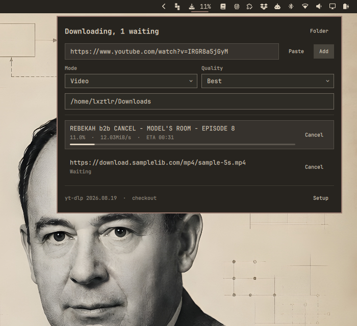
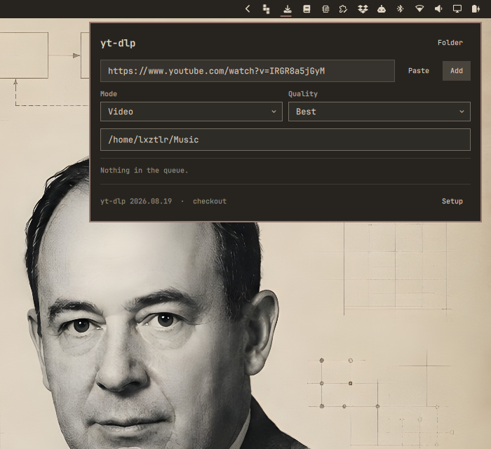
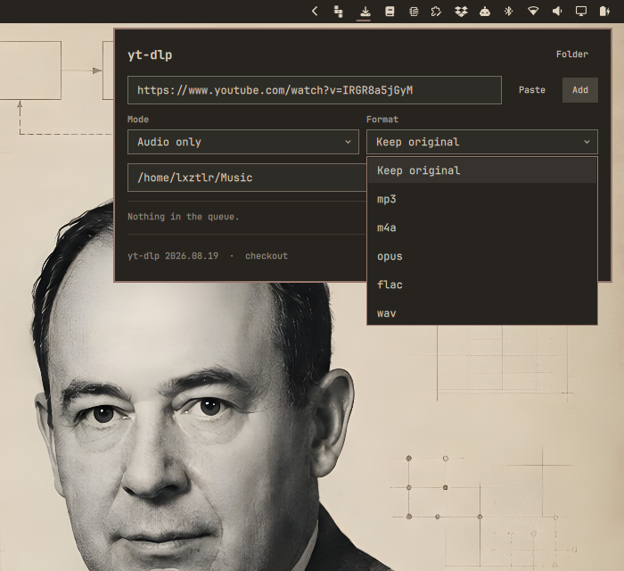
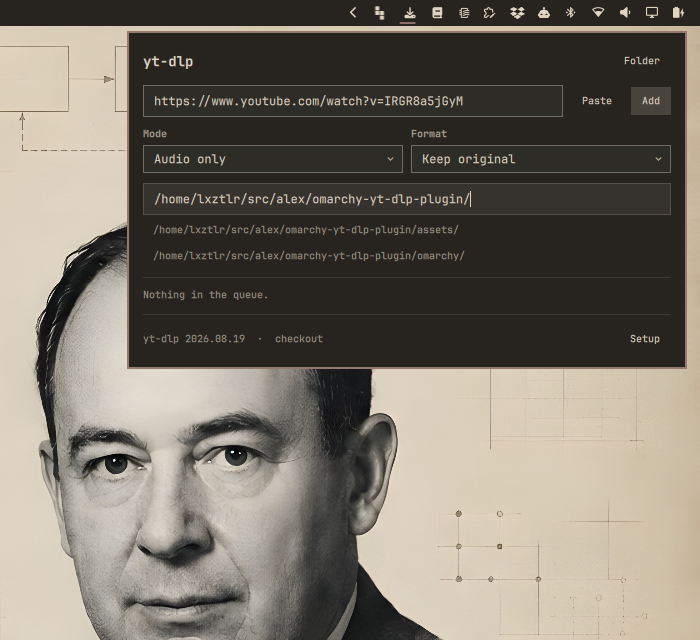
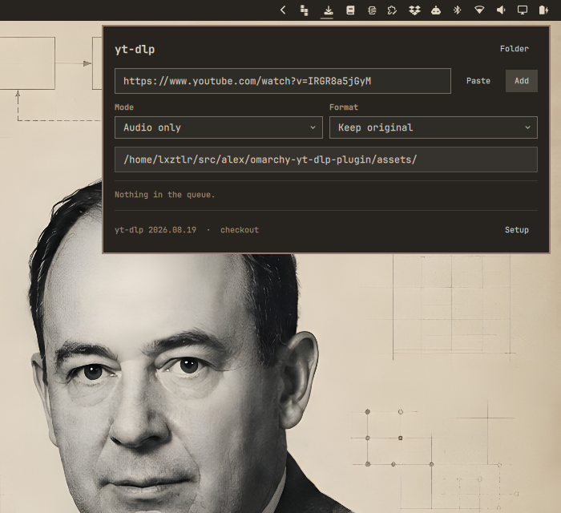
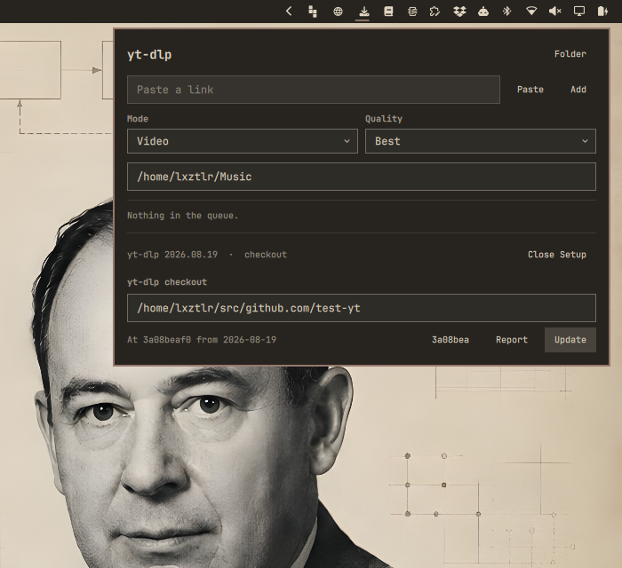
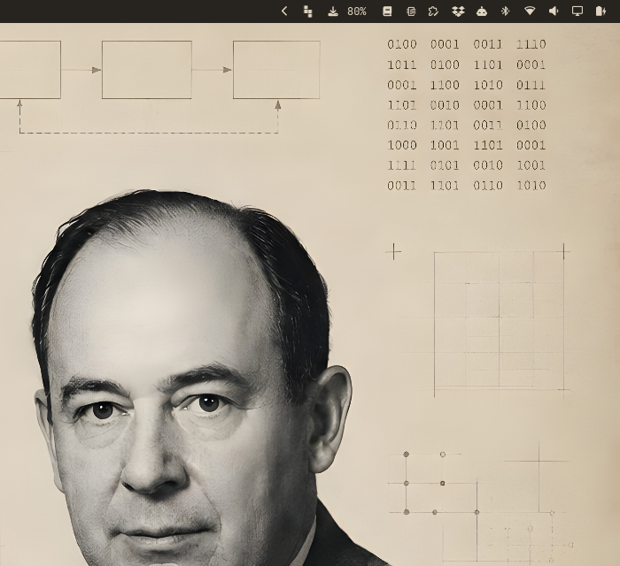

# omarchy-yt-dlp-plugin

A download queue for [yt-dlp](https://github.com/yt-dlp/yt-dlp) in the Omarchy
bar. Paste a link, pick video or audio, and watch the queue work through it.



## Glossary

Bar widget
: A plugin that draws an icon in the Omarchy bar and opens a panel below it.
  The bar, the notifications and every panel share one Quickshell process.

Job
: One link plus the choices made for it. A job carries its own state on disk
  and outlives a restart of the shell.

Worker
: The process that works the queue. One at a time, held by a lock, started by
  `add` and gone once the queue runs dry.

Checkout
: A git clone of the yt-dlp source, parked on the commit this plugin ships. The
  plugin runs yt-dlp from it when there is one, and can fetch it and move it
  back onto that commit.

## What it does

- Reads the clipboard when the panel opens and fills the link field with it,
  as long as the field is still empty.
- Downloads video, or audio only. For video the height can be capped at
  1080p, 720p or 480p. For audio the container can be kept as the source
  offers it, or set to mp3, m4a, opus, flac or wav.
- Queues every link. One download runs, the rest wait in the order they
  were added.
- Shows title, percentage, speed and ETA per job, and the percentage of the
  running download in the bar itself.
- Cancels a running download and takes a waiting one out of the queue.
- Opens the target folder, either from the head of the panel or by clicking a
  finished job.
- Completes folder names while typing a path.
- Fetches and updates the yt-dlp checkout, into a folder of your choosing.

Mode, quality, audio format, target folder and checkout folder are kept in
`~/.config/omarchy/shell.json`, so the next link needs no setup.



*The panel picks the link up from the clipboard when it opens.*


*Video or audio only.*



*In audio mode the second column offers the container instead of a height.*

## Typing a path

Both path fields complete folder names:

- **Tab** fills in as far as the candidates agree.
- **Enter** takes the path and closes the suggestions.
- **Escape** closes the suggestions. A second Escape closes the panel.
- Clicking a suggestion takes it.

`Add`, `Folder` and `Clone` read what stands in the field, whether or not
Enter was pressed first.





*Tab filled the one candidate in and asked again for what lies below it.*

## Which yt-dlp runs

The checkout wins over the package at `/usr/bin/yt-dlp`. Arch lags weeks behind
upstream, and YouTube breaks yt-dlp often enough that those weeks decide
whether a download works or returns a 403. The package stays as the fallback,
so moving the checkout away costs convenience but not the plugin.

Where the checkout sits differs from machine to machine, so it is a setting.
`~/src/github.com/yt-dlp` is only the starting value. The foot of the panel
names the version in use and where it came from; `Setup` opens the folder
field, the state of the checkout, and a button that clones or fetches it.

The checkout does not follow yt-dlp's master branch. It sits on one commit,
written down in `omarchy/ytdlp-queue`, and `Clone` and `Update` both leave it
there. So a user runs the yt-dlp source that came with this plugin, not
whatever upstream pushed since. The short hash beside the buttons names that
commit and opens yt-dlp's releases, where a newer one can be read off.

The checkout is only used while it still is that source. Before every run the
plugin asks the folder three questions: does `HEAD` name the commit shipped
here, does `origin` name yt-dlp, and did anyone edit a tracked file. Untracked
files are ignored, since a run leaves caches behind. If one answer is wrong,
the package takes over, and the foot of the panel says `package` instead of
`checkout`.

Raising the commit is a release of this plugin. Until then the checkout stays
where it is, and `Update` only repairs a checkout that drifted off. `Report`
opens a prepared issue against this repository, filled with the commit in use,
so a newer yt-dlp can be asked for without writing the report from scratch.

Cloning never touches a folder that already holds something else.



## Install

```bash
omarchy plugin add https://github.com/AlexZeitler/omarchy-yt-dlp-plugin.git --enable
omarchy restart shell
```

The bar icon lands in the right section. Move it with
`omarchy bar move alexzeitler.ytdlp --section right --before <widget>`.

## Remove

```bash
omarchy plugin remove alexzeitler.ytdlp
omarchy restart shell
```

That takes the plugin and its bar entry out. The queue keeps its own state,
which is left behind on purpose so a removal does not throw away a download
history. Remove it as well with:

```bash
rm -rf "${XDG_STATE_HOME:-$HOME/.local/state}/omarchy-ytdlp"
```

Downloaded files are never touched: they live wherever the target folder
pointed.

## Working on it

For development, copy the folder in place rather than installing from git:

```bash
cp -a manifest.json omarchy ~/.config/omarchy/plugins/alexzeitler.ytdlp/
omarchy restart shell
```

The restart is not optional. Omarchy starts Quickshell with its file watcher
off, so a changed `.qml` file only takes effect once the process comes back.
`omarchy plugin disable` and `enable` do not reload plugin code, and
`omarchy-shell shell rescanPlugins` does not either.

## How the queue works

The widget never runs yt-dlp. It asks `omarchy/ytdlp-queue`, and that script
owns the queue. A download therefore survives a restart of the shell, which a
job owned by the QML process would not.

State lives under `${XDG_STATE_HOME:-~/.local/state}/omarchy-ytdlp/`:

```
jobs/<id>.json        the job: link, choices, status, title, error
jobs/<id>.progress    percentage, speed and ETA of the running download
logs/<id>.log         everything yt-dlp printed that was not progress
worker.lock           held by the worker, so only one download runs
```

Progress lives beside the job rather than inside it. It changes many times a
second, and a running download would otherwise rewrite its job file constantly.

Every job stores the checkout it was queued with, so changing the setting does
not move a download that is already waiting.



*With the panel closed the bar still carries the one number worth carrying.*

The script works on its own as well:

```bash
ytdlp-queue add <url> [--mode video|audio] [--quality best|<height>]
                      [--audio-format keep|<format>] [--dest <dir>]
                      [--checkout <dir>]
ytdlp-queue list                    # every job as a JSON array, oldest first
ytdlp-queue cancel <id>             # stop a running job, drop a queued one
ytdlp-queue clear                   # forget everything no longer running
ytdlp-queue default-dest            # where a job lands when no folder is given
ytdlp-queue complete-dir <prefix>   # folders that continue the prefix
ytdlp-queue checkout status [--dir <dir>]
ytdlp-queue checkout sync   [--dir <dir>]
ytdlp-queue binary [--dir <dir>]    # which yt-dlp runs, from where, version
```

## Things worth knowing

- **The bar walks backwards.** For video, yt-dlp fetches the video stream and
  the audio stream one after the other, and each counts from zero. The panel
  shows what yt-dlp reports. A smoothed number would hide that a second file
  is still on its way.
- **A playlist link downloads one video.** The queue passes `--no-playlist`.
  Without it a single link could turn into hundreds of downloads that the
  queue knows nothing about.
- **Keep original re-encodes nothing.** Extraction then runs without a target
  format, so a stream that already plays is left alone. Typically `.m4a`.
  Every other format goes through ffmpeg.
- **A source without audio fails in audio mode.** yt-dlp reports it, and the
  panel shows the error on the job.

## Requirements

`jq`, `git`, `wl-paste`, `xdg-user-dir`, `flock` and `ffmpeg`. All of them ship
with Omarchy.
