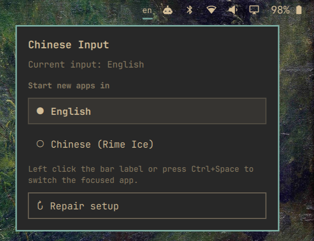

# Chinese Input for Omarchy


An Omarchy 4 Quattro bar plugin for English and Simplified Chinese input with Fcitx5 and [Rime Ice](https://github.com/iDvel/rime-ice).

The bar shows `en` or `cn`. Left click the label—or press `Ctrl+Space`—to switch the focused app. Right click opens a small panel where you can choose whether new apps start in English or Chinese.

## Install

One line install in your terminal:

```bash
omarchy plugin add https://github.com/gohlihan/omarchy-cn-input-plugin.git --enable
```

The widget initially shows `--`. Right click it and choose **Install Chinese input**. A terminal opens for the guided setup because installing packages requires confirmation and may request your password.

The setup installs:

- `fcitx5-rime` from the Arch repositories, through `omarchy pkg add`
- `rime-ice-pinyin-git` from the AUR, through `yay`

An existing `rime-ice-git` installation is also supported. Setup then enables only the Rime Ice full-pinyin schema and adds Rime to the current Fcitx5 input-method group.

Fresh installations start new apps in English. Right click the widget to change that preference.

## What it changes

The plugin relies on the Fcitx5 service and input-method environment already provided by Omarchy 4. It does not modify `/etc/security/pam_env.conf` or replace Omarchy's system files.

User configuration changes are deliberately narrow:

- `~/.config/fcitx5/config`: sets `Behavior/ActiveByDefault`; adds `Ctrl+Space` only when a custom trigger-key section exists and lacks it.
- `~/.local/share/fcitx5/rime/default.custom.yaml`: adds the `rime_ice` schema while preserving existing customizations.
- The current Fcitx5 group: appends `rime` while preserving its keyboard/layout entries.

Before editing an existing file, the controller copies it to:

```text
~/.local/state/community.cn-input/backups/
```

If an existing Rime YAML file uses a form that cannot be amended safely, setup stops and explains what needs manual attention; it does not overwrite the file.

## Commands

The panel normally runs these for you. They are also available from the installed plugin directory:

```bash
scripts/cn-inputctl status
scripts/cn-inputctl toggle
scripts/cn-inputctl set-mode en
scripts/cn-inputctl set-mode cn
scripts/cn-inputctl set-startup en
scripts/cn-inputctl set-startup cn
scripts/setup
```

`status` emits JSON for the widget. The startup choice controls the default state of new input contexts; it does not forcibly change text fields that are already open.

## Update and repair

Update through Omarchy:

```bash
omarchy plugin update community.cn-input
```

To repair the Fcitx/Rime setup, right click the widget and choose **Repair setup**. The operation is idempotent: it does not intentionally duplicate schemas, hotkeys, or group entries.

If the shell ever fails to hot-reload the plugin, run:

```bash
omarchy restart shell
```

## Remove

Remove the widget and its plugin files with:

```bash
omarchy plugin remove community.cn-input
```

Removal leaves Fcitx5, Rime Ice, your user configuration, and backups intact. This avoids breaking another input-method setup that uses them. Remove those separately only if you know they are no longer needed.

## Development

Validate and test from the repository root:

```bash
omarchy plugin validate .
qmllint -I /usr/share/omarchy/shell BarWidget.qml Panel.qml
./tests/cn-inputctl-test.sh
```

The implementation follows the [Omarchy plugin guide](https://omarchyplugins.com/develop.html), updates the older [manual Chinese-input approach](https://gist.github.com/wey-gu/2875e6037829fa3e78b5f2e5365b71c2) for Omarchy 4, and uses the [Rime Ice full-pinyin schema](https://github.com/iDvel/rime-ice#安装).


## Reference
雾凇拼音 | 长期维护的简体词库
https://github.com/iDvel/rime-ice

## License

MIT
