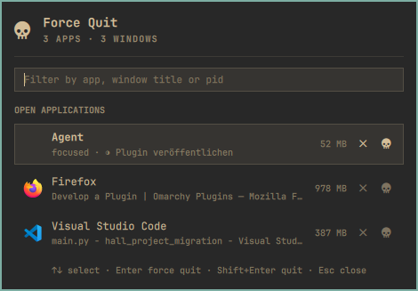

# Force Quit

A macOS-style Force Quit panel for the [Omarchy](https://omarchy.org) shell. Open it, see every window that is open, end the one that stopped answering.

`SUPER + ALT + ESCAPE` is the natural home for it — the same shape as macOS's `CMD + ALT + ESC`.



## Rows are processes, not windows

The list groups windows by the process that owns them, so a browser with four
windows is one row that says so. That is not a display choice: a signal ends a
process, and there is no signal that ends a window. macOS lists applications in
its Force Quit dialog for the same reason.

Each row shows the application's name and icon (from its desktop entry), the
window title, resident memory, and — only when they apply — `focused`,
`3 windows`, `workspace 4`, `xwayland`, or a `zombie` / `stopped` / `stuck in
I/O` process state.

## Two ways out, and the difference matters

| Action | What it does |
|---|---|
| **Quit** | Asks Hyprland to close each of the process's windows. The application sees the request and can still put up a save prompt. |
| **Force quit** | `SIGKILL`. The application does not see it, cannot refuse it, and cannot save through it. |

Force quit is deliberately two steps: the first press arms the row, which turns
red and says what is about to be lost; the second confirms. An armed row
disarms itself after a few seconds, and on `Esc`, or as soon as the cursor
moves to a different row.

## Install

```bash
omarchy plugin add https://github.com/RogerGdot/omarchy-forcequit.git --enable
```

Optional keybinding, in `~/.config/hypr/bindings.lua`:

```lua
o.bind("SUPER + ALT + ESCAPE", "Force quit", "omarchy-shell rogergdot.forcequit toggle")
```

`SUPER + ESCAPE` is the Omarchy system menu, so the `ALT` variant is free by default — check yours with `omarchy menu keybindings --print`.

## Using it

| Input | Result |
|---|---|
| Click the bar icon | Open or close the panel |
| Type | Filter by application, window title or pid |
| `↑` `↓`, `PageUp` `PageDown` | Move the cursor |
| `Enter` | Force quit — first press arms, second confirms |
| `Shift` + `Enter` | Quit (lets the application save) |
| Click a row | Arms force quit for that row |
| Middle-click a row | Quit |
| Row buttons | `󰅖` quit · `󰚌` force quit |
| `Esc` | Unwinds one layer: the confirmation, then the filter, then the panel |
| `Tab` | Cycle to the neighbouring bar panel |

## Settings

Set on the widget's entry in `~/.config/omarchy/shell.json`, or from the CLI:

```bash
omarchy bar set rogergdot.forcequit requireConfirm false --json
omarchy bar set rogergdot.forcequit visibleRows 12 --json
```

| Key | Default | Meaning |
|---|---|---|
| `requireConfirm` | `true` | Ask before force quitting. Set to `false` and the first `Enter` kills — that is the whole safety net, so consider it carefully. |
| `confirmSeconds` | `5` | How long an armed row waits before disarming itself |
| `visibleRows` | `8` | Rows shown before the list scrolls |

## Scripting

```bash
omarchy-shell rogergdot.forcequit list        # pid, name, window count
omarchy-shell rogergdot.forcequit quit <pid>  # close the process's windows
omarchy-shell rogergdot.forcequit kill <pid>  # SIGKILL, no confirmation
omarchy-shell rogergdot.forcequit toggle      # open/close the panel
```

## Requirements and privileges

Hyprland (queried through `hyprctl`), `ps` from procps, and the Omarchy shell
itself. Nothing runs privileged: the plugin signals processes owned by the user
running the shell, exactly as `kill` from that user's terminal would. It reads
window metadata from `hyprctl -j clients` and memory and process state from
`ps`; nothing leaves the machine, and no configuration is written.

## Removing

```bash
omarchy plugin disable rogergdot.forcequit
omarchy plugin remove rogergdot.forcequit
```

Remove the `o.bind("SUPER + ALT + ESCAPE", ...)` line from
`~/.config/hypr/bindings.lua` too, if you added it.

## Development

```bash
omarchy plugin validate .
qmllint -I "$OMARCHY_PATH/shell" Panel.qml
```

Editing a plugin in place does not fully hot-reload: an imported `.js` and the
`IpcHandler` keep serving the previous code. Run `omarchy restart shell` after
a change, and do not judge the change before you have.

## License

MIT — see [LICENSE](LICENSE).
